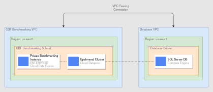

# CDF Benchmarking Use Case 1 Environment Setup



This Terraform script can be used to spin up the GCP resources required for benchmarking the following 
Use Case 1 pipelines:
- Pipelines with no transformations (SQLServer -> GCS, SQLServer to BQ)
- Pipelines with transformations (SQLServer -> Wrangler -> BQ)
- Pipelines with aggregates (SQLServer -> Wrangler -> GroupBy -> BQ)

Note that the actual pipelines need to be run using the pipeline automation scripts that leverage the 
[CDAP REST API](https://cloud.google.com/data-fusion/docs/reference/cdap-reference).


## List of Resources

- One (1) Private Cloud Data Fusion Enterprise Instance
- Two (2) Static IP addresses for SQL Server VMs
- Two (2) Compute Engine VMs (32 & 64 vCPUs) with SQL Server preinstalled installed using a startup script
- One (1) Private IP range for Cloud Data Fusion
- Two (2) VPC Networks for the private Cloud Data Fusion instance and the Database VMs
- Two (2) Subnets under the Cloud Data Fusion VPC Network and Database VPC Network (one under each network)
- One (1) Firewall Rule to allow traffic to TCP port 22 (to SSH into the VM and generate TPC-H data)
- One way Peering connection between the private Cloud Data Fusion VPC network and the VPC network in the tenant project
- Two way Peering connection between the private Cloud Data Fusion VPC network and the Database VPC network


## Prerequisites

### Install Terraform
Install Terraform by following the steps mentioned in documentation 
[here](https://learn.hashicorp.com/tutorials/terraform/install-cli?in=terraform/gcp-get-started) 

### Serivce Account
Create a service account with the following permissions
- Compute Admin
- Cloud Data Fusion Admin

### Variables 
Create a *terraform.tfvars* file in the terraform root directory with the following variables
```
credentials_path = [path/to/service-account-key.json]
project_id       = [project_id]
```

The following variables can also be set. Default values in the *variables.tf* file will be picked up if not present in
the *terraform.tfvars* file
```
default_region                 = "us-west1"
default_zone                   = "us-west1-a"
cdf_vpc_subnet_cidr_range      = "10.0.0.0/20"
database_vpc_subnet_cidr_range = "10.10.0.0/20"
cdf_uc1_enable_logging         = true
cdf_uc1_enable_monitoring      = true
```


## Creating the resources

To provision the resources, run the following from within this directory    
- `terraform init` to prepare the current working directory for use with Terraform  
- `terraform plan` to get a list of the resources that would be created
- `terraform apply` to create the resources


## Destroying the resources

The resources can be deleted after running the desired benchmarking pipelines by running `terraform destroy`
