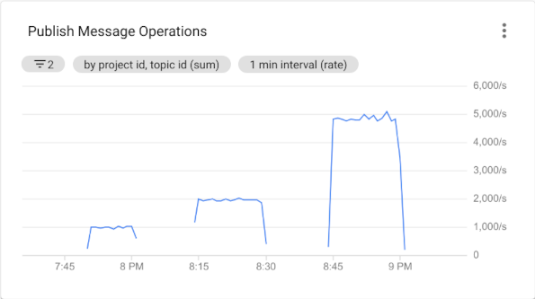

# Pub/Sub Publisher

This program can be used to publish messages of sizes 1, 10 & 100 KB to a Pub/Sub topic at rates of 
1000, 2000 & 5000 messages/sec. Each thread achieves a publish rate of 1000 messages/sec, so mulitple 
threads are used to achieve publish rates of 2000 & 5000 messages/sec.

All tests were carried out on an [n2-standard-8](https://cloud.google.com/compute/docs/machine-types#n2_standard_machine_types) 
Google Compute Engine VM.

## Requirements

- JDK 8
- Maven

## Usage

Build the project by running `mvn clean package` in the root directory of this project. To start the program, run    
`java -jar target/pubsub-publisher-1.0-SNAPSHOT-shaded.jar [PROJECT_ID] [TOPIC_ID] [PUBLISH_RATE] [MESSAGE_SIZE]`  
where,  
`PROJECT_ID`   - GCP Project ID  
`TOPIC_ID`     - Pub/Sub Topic ID  
`PUBLISH_RATE` - Rate at which messages should be published to the topic. One of 1000, 2000 or 5000  
`MESSAGE_SIZE` - Size of the message to be published. One of 1, 10 or 100  
